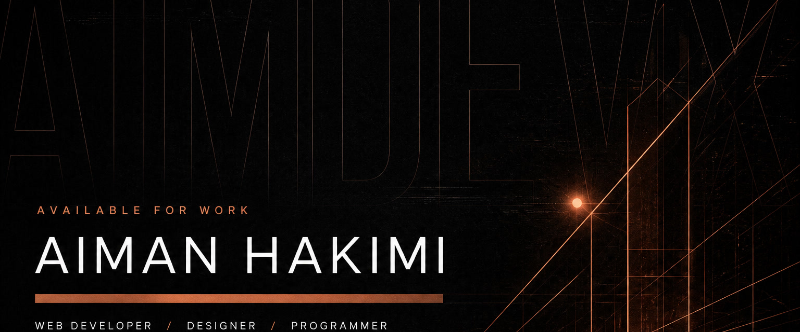
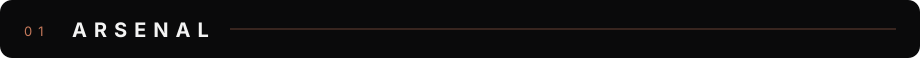
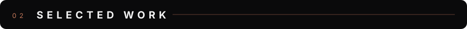
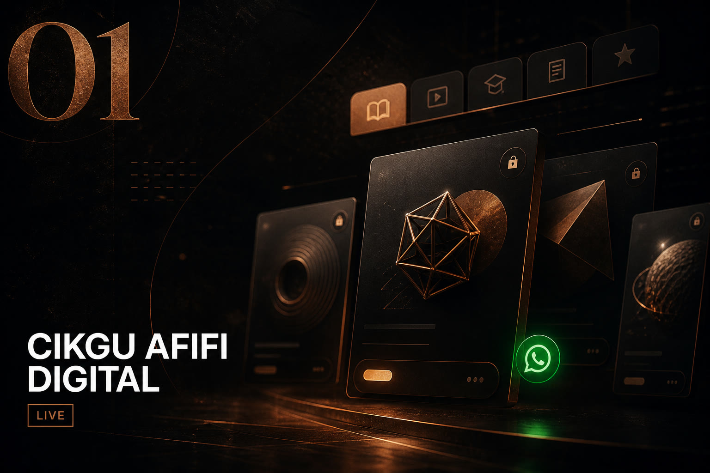
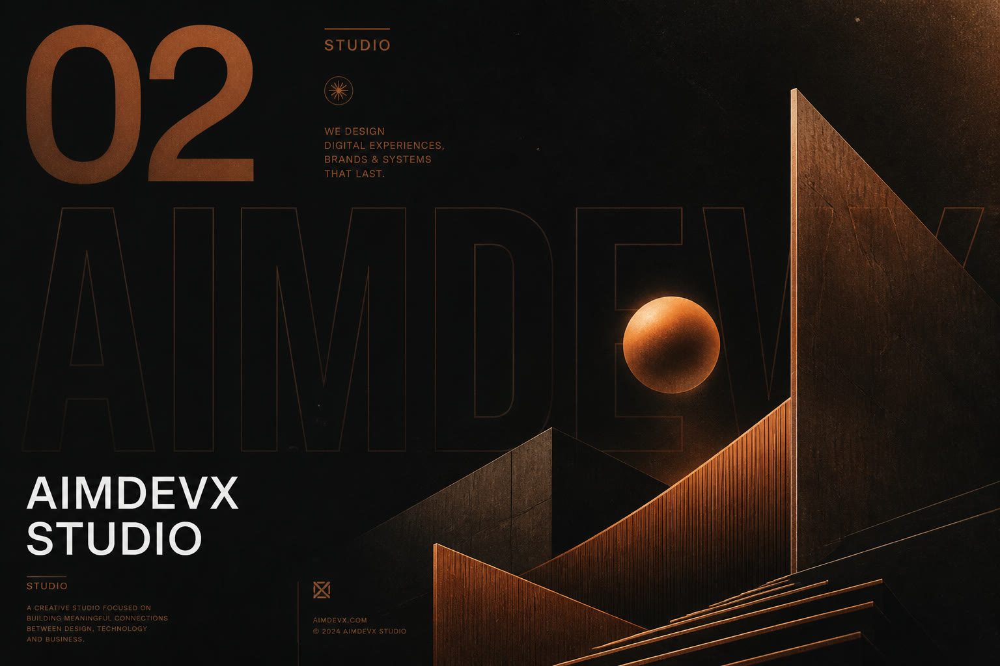
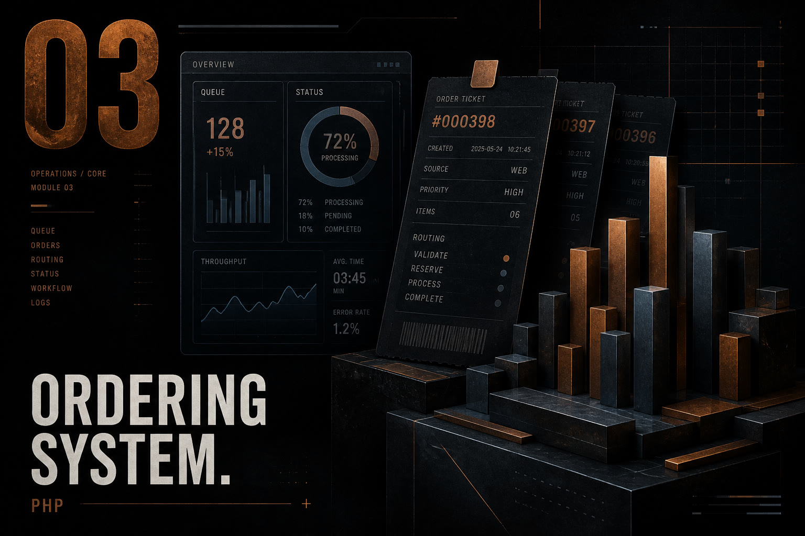
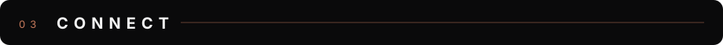

  

  

  

  
  
  
  

  

  

  

  

  
  
  

  

<table>
  <tr>
    <td width="33%" valign="top">
      
      

        <a href="https://digital.aimdevx.com"><strong>Live store →</strong></a>
      

    </td>
    <td width="33%" valign="top">
      
      

        <a href="https://aimdevx.com"><strong>aimdevx.com →</strong></a>
      

    </td>
    <td width="33%" valign="top">
      
      

        <a href="https://github.com/aimanhakimii/orderingSystem"><strong>Repository →</strong></a>
      

    </td>
  </tr>
</table>

  

  
  
  

  

  <b>Design with intention. Build with precision.</b>

