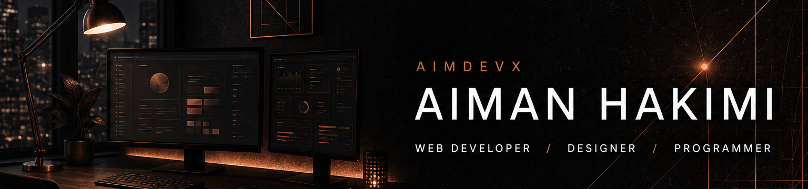

<p align="center">
  
</p>

## 🎯 About Me

<table>
<tr>
<td width="58%" valign="top">

```javascript
const aiman = {
  name: "Aiman Hakimi",
  brand: "AIMDEVX",
  role: "Web Developer · Designer · Programmer",
  location: "Penang, Malaysia",
  status: "Available for work",

  building: [
    "Client web products",
    "Digital storefronts",
    "Operations systems"
  ],

  tech: {
    frontend: ["React", "Next.js", "Tailwind", "Bootstrap"],
    backend: ["Laravel", "PHP", "Node.js"],
    database: ["MySQL", "PostgreSQL"]
  }
};
```

<br>

<p>
  <i>"Design with intention. Build with precision."</i>
</p>

</td>
<td width="42%" align="center">
  
</td>
</tr>
</table>

<br>

## 🛠️ Tech Arsenal

<table align="center">
<tr>
<td width="50%" align="center">

<h3>🎨 Frontend & UI</h3>


<br><br>


<br><br>

<h3>⚙️ Backend & Database</h3>


<br><br>


</td>
<td width="50%" align="center">

<h3>🧰 Tools & Workflow</h3>


<br><br>


<br><br>

<h3>🤖 AI-Powered Development</h3>


</td>
</tr>
</table>

<br>

## 💼 Selected Work

<table>
  <tr>
    <td width="33%" valign="top">
      <a href="https://digital.aimdevx.com">
        
      </a>
      <p align="center"><a href="https://digital.aimdevx.com"><strong>Live store →</strong></a></p>
    </td>
    <td width="33%" valign="top">
      <a href="https://aimdevx.com">
        
      </a>
      <p align="center"><a href="https://aimdevx.com"><strong>aimdevx.com →</strong></a></p>
    </td>
    <td width="33%" valign="top">
      <a href="https://github.com/aimanhakimii/orderingSystem">
        
      </a>
      <p align="center"><a href="https://github.com/aimanhakimii/orderingSystem"><strong>Repository →</strong></a></p>
    </td>
  </tr>
</table>

<br>

## 🌐 Connect with Me

<p align="center">
  <a href="https://aimdevx.com">
    
  </a>
  &nbsp;
  <a href="https://github.com/aimanhakimii">
    
  </a>
  &nbsp;
  <a href="https://digital.aimdevx.com">
    
  </a>
  &nbsp;
  <a href="mailto:aimn.hkmii@gmail.com">
    
  </a>
</p>

<br>

## 📊 GitHub Analytics

<p align="center">
  
  
</p>

<p align="center">
  
</p>

<p align="center">
  
</p>

<p align="center">
  
  
</p>

<p align="center">
  
  
</p>

<p align="center">
  
</p>

<p align="center">
  <b>Design with intention. Build with precision.</b>
</p>
